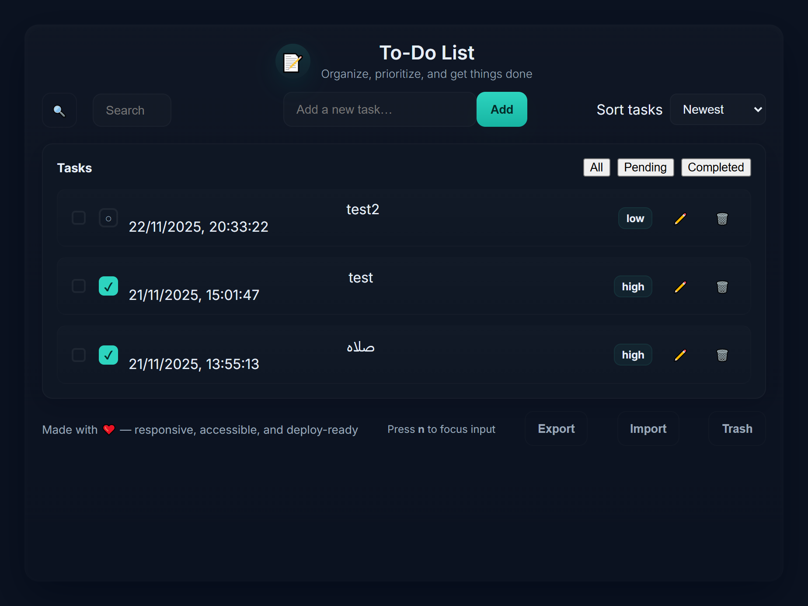
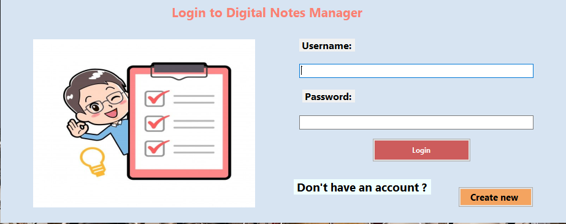

  

<h1 align="center">Hi, I’m Mahmoud Mostafa 👋</h1>

  <strong>Full Stack .NET Developer</strong> • Clean architecture • Maintainable and testable systems

---

## About me
I am a Full Stack .NET developer with a background in dentistry who transitioned into software engineering through intensive training at ITI. I build robust web applications using .NET (backend) and Angular (frontend), focusing on clean code, scalable architecture, and real-world impact.

**Quick facts**
- Location: Egypt  
- Open to: Freelance, Collaboration, Full-time roles  
- Email: elsafi19_dx72@yahoo.com

---

## Tech stack
## Tech Stack

### Backend

  
  
  

### Frontend

  
  
  
  

### Styling & UI

  
  
  
  

### Database

  

### Tools & DevOps

  
  
  
  

---

## Featured Projects

  

  <strong>To Do List</strong> 
  <small>Simple to-do app demonstrating DOM manipulation and localStorage.</small>

---

  

  <strong>Movie App</strong> 
  <small>Movie browsing app consuming external APIs with clean UI.</small>

---

  

  <strong>Digital Notes Manager</strong> 
  <small>Desktop-style notes manager with CRUD operations and persistence.</small>

---

  

  <strong>Safistore</strong> 
  <small>Angular e-commerce front-end with product catalog and cart UI.</small>

---

## GitHub stats

  
  

---

## Certificates & Education
- **Full Stack .NET Track (ITI)** — completed.  
- **Object Oriented Programming (ITI)** — Completion: 2025.  
- **Database Fundamentals (ITI)** — Completed: Feb 8, 2025. — Verification code: `nAXm3CVuJG`  
- **OpenAI GPTs: Creating Custom AI Assistants (Vanderbilt / Coursera)** — Completed: Nov 5, 2025.

---

---

## Contact
- LinkedIn: https://www.linkedin.com/in/mahmoud-mostafa-824169244  
- Email: elsafi19_dx72@yahoo.com  
- GitHub: https://github.com/jodx19

---

*Last updated: January 2026*
